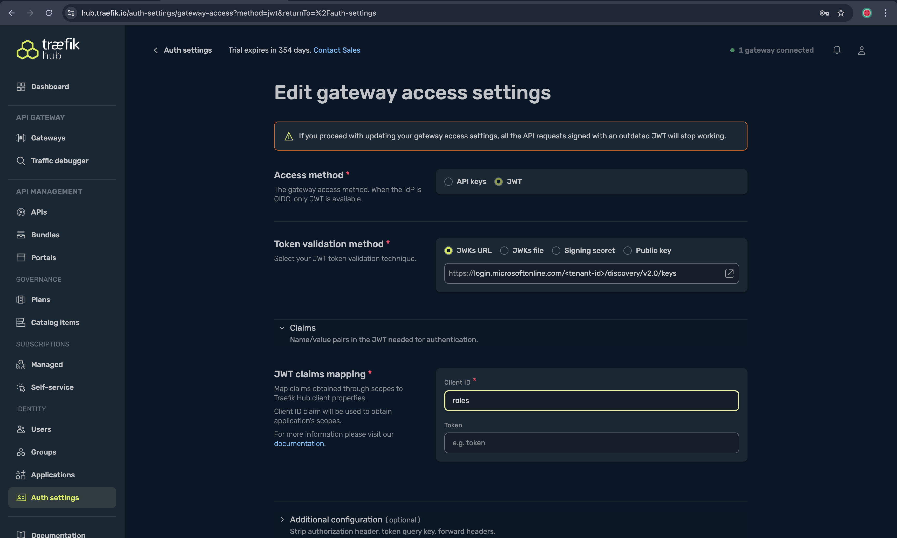

# Multi-cluster API Management with Traefik Hub

## Overview

This drop demonstrates how to enable API management with Traefik Hub to manage and secure your applications. It extends the previous drops by adding API management capabilities to the Traefik Airlines application.

Traefik can support any Oauth2.0 compliant Identity Provider or you can use Traefik Hub Managements OOTB Identity Provider. In this drop we will use Microsoft Entra ID as the Identity Provider.

The terraform script will create a Microsoft Entra ID application and a group for each user type. The group will be used to assign the appropriate permissions to the user type.

## Prerequisites

* [Install or update Azure CLI to version 2.65.0 and above](https://learn.microsoft.com/cli/azure/install-azure-cli?view=azure-cli-latest). Use the below command to check your current installed version.

  ```shell
  az --version
  ```

* [Optional] [Install k3d](https://k3d.io/stable/#installation)

* [Optional] [Install and configure awscli if you plan to deploy EKS](https://docs.aws.amazon.com/cli/latest/userguide/getting-started-install.html)

* [Optional] [Install and configure gcloud if you plan to deploy GKE](https://cloud.google.com/sdk/docs/install)

* [Optional] [Install gke-cloud-auth-plugin if you plan to deploy GKE](https://cloud.google.com/kubernetes-engine/docs/how-to/cluster-access-for-kubectl)

* [Install Terraform](https://learn.hashicorp.com/tutorials/terraform/install-cli)

* [Install kubectl](https://kubernetes.io/docs/tasks/tools/install-kubectl/)

* Create Azure service principal (SP)

  The Azure service principal assigned with the "Contributor" role is required to complete the scenario and its related automation. To create it, log in to your Azure account run the below command (you could also do this in [Azure Cloud Shell](https://shell.azure.com/)).

    ```shell
    az login
    subscriptionId=$(az account show --query id --output tsv)
    az ad sp create-for-rbac -n "<Unique SP Name>" --role "Contributor" --scopes /subscriptions/$subscriptionId
    ```

    For example:

    ```shell
    az login
    subscriptionId=$(az account show --query id --output tsv)
    az ad sp create-for-rbac -n "JumpstartArcK8s" --role "Contributor" --scopes /subscriptions/$subscriptionId
    ```

    Output should look like this:

    ```json
    {
    "appId": "XXXXXXXXXXXXXXXXXXXXXXXXXXXX",
    "displayName": "JumpstartArcK8s",
    "password": "XXXXXXXXXXXXXXXXXXXXXXXXXXXX",
    "tenant": "XXXXXXXXXXXXXXXXXXXXXXXXXXXX"
    }
    ```

    > **Note:** If you create multiple subsequent role assignments on the same service principal, your client secret (password) will be destroyed and recreated each time. Therefore, make sure you grab the correct password.

* [Enable subscription with](https://learn.microsoft.com/azure/azure-resource-manager/management/resource-providers-and-types#register-resource-provider) the two resource providers for Azure Arc-enabled Kubernetes. Registration is an asynchronous process, and registration may take approximately 10 minutes.

  ```shell
  az provider register --namespace Microsoft.Kubernetes
  az provider register --namespace Microsoft.KubernetesConfiguration
  az provider register --namespace Microsoft.ExtendedLocation
  az provider register --namespace Microsoft.ContainerService
  ```

  You can monitor the registration process with the following commands:

  ```shell
  az provider show -n Microsoft.Kubernetes -o table
  az provider show -n Microsoft.KubernetesConfiguration -o table
  az provider show -n Microsoft.ExtendedLocation -o table
  az provider show -n Microsoft.ContainerService -o table
  ```

* Install the Azure Arc for Kubernetes CLI extensions ***connectedk8s*** and ***k8s-configuration***:

  ```shell
  az extension add --name connectedk8s
  az extension add --name k8s-configuration
  ```

  > **Note:** If you already used this guide before and/or have the extensions installed, use the below commands.

  ```shell
  az extension update --name connectedk8s
  az extension update --name k8s-configuration
  ```

* Accept Terms for Traefik for Azure Arc. You can either choose to run this command to accept the Traefik terms or accept the terms in the Azure Arc [marketplace](https://portal.azure.com/#view/Microsoft_Azure_Marketplace/GalleryItemDetailsBladeNopdl/id/containous.traefik-on-arc).

  ```shell
  az term accept --publisher containous --product traefik-on-arc --plan traefik-byol
  ```

## Getting Started

You need a [Traefik Hub](https://hub.traefik.io/) account. You can sign up [here](https://hub.traefik.io/). If you have a Traefik Hub account, please navigate to the [gateways](https://hub.traefik.io/gateways) section and create a gateway per cluster. You will need the license key for each cluster to deploy the Traefik instances. You can follow this guide to grab the license key for each cluster: [here](https://doc.traefik.io/traefik-hub/operations/installation#before-you-begin).

Clone the Traefik Azure Arc Jumpstart GitHub repository

  ```shell
  git clone https://github.com/traefik/traefik-azure-arc-jumpstart-drops.git
  ```

Upgrade Traefik Proxy to Traefik Hub Management and deploy Traefik API CRDs to manage Traefik Airlines routes:

  ```shell
  cd traefik-azure-arc-jumpstart-drops
  terraform init
  terraform apply \
    -var="azureSubscriptionId=$(az account show --query id -o tsv)" \
    -var="enableTraefikHubManagement=true" \
    -var="traefikHubAKSLicenseKey=<YOUR_TRAEFIK_HUB_LICENSE_KEY_1>"
  ```

You can also enable the install on k3d, EKS or GKE clusters as well using Terraform:

  ```shell
  cd traefik-azure-arc-jumpstart-drops
  terraform init
  terraform apply \
    -var="azureSubscriptionId=$(az account show --query id -o tsv)" \
    -var="googleProjectId=$(gcloud config get-value project)" \
    -var="enableTraefikHubManagement=true" \
    -var="enableK3D=true" \
    -var="enableGKE=true" \
    -var="enableEKS=true" \
    -var="traefikHubK3DLicenseKey=<YOUR_TRAEFIK_HUB_LICENSE_KEY_1>" \
    -var="traefikHubAKSLicenseKey=<YOUR_TRAEFIK_HUB_LICENSE_KEY_2>" \
    -var="traefikHubEKSLicenseKey=<YOUR_TRAEFIK_HUB_LICENSE_KEY_3>" \
    -var="traefikHubGKELicenseKey=<YOUR_TRAEFIK_HUB_LICENSE_KEY_4>"
  ```

Finally, update the Traefik Hub Management gateway access settings and add the Microsoft Entra ID JWKS endpoint under `Token validation method`. And enter `roles` under JWT claims mapping:

  ```shell
  echo login.microsoftonline.com/$(terraform output -raw entraIDTenantID)/discovery/v2.0/keys
  ```



## Testing

Verify that Traefik Airlines applications are exposed through Traefik through the Arc-enabled clusters. You can choose any of the clusters to test against.

  ```shell
  aks_address="$(kubectl get svc traefik-aks --namespace traefik --context aks-traefik-demo -o jsonpath='{.status.loadBalancer.ingress[0].ip}')"
  k3d_address="localhost:8000"
  eks_address="$(kubectl get svc traefik-eks --namespace traefik --context eks-traefik-demo -o jsonpath='{.status.loadBalancer.ingress[0].hostname}')"
  gke_address="$(kubectl get svc traefik-gke --namespace traefik --context gke-traefik-demo -o jsonpath='{.status.loadBalancer.ingress[0].ip}')"
  ```

### Generate JWT token

Before you generate a JWT token, you must login with the user that you are generating a token for and consent to the application permissions.

  ```shell
  username=$(terraform output entraIDUsers | grep -oE '"[^"]+"' | head -n1 | tr -d '"')
  echo $username
  ```

Consent link:

```shell
echo "https://login.microsoftonline.com/$(terraform output -raw entraIDTenantID)/oauth2/v2.0/authorize?client_id=$(terraform output -raw entraIDApplicationClientID)&response_type=code&response_mode=query&scope=User.Read&prompt=consent"
```

Visit [https://login.microsoftonline.com](https://login.microsoftonline.com) and login with the user that you are generating a token for and consent to the application permissions. The password is `topsecretpassword`. You will be required to setup MFA for the user. 

  ```shell
  access_token=$(curl -s -X POST -H 'Content-Type: application/x-www-form-urlencoded' \
    https://login.microsoftonline.com/$(terraform output -raw entraIDTenantID)/oauth2/v2.0/token \
    -d "client_id=$(terraform output -raw entraIDApplicationClientID)" \
    -d "client_secret=$(terraform output -raw entraIDApplicationClientSecret)" \
    -d "scope=$(terraform output -raw entraIDApplicationClientID)/.default" \
    -d "grant_type=password" \
    -d "username=$username" \
    -d "password=topsecretpassword" | grep -o '"access_token":"[^"]*' | cut -d'"' -f4)
  ```

  Verify that you obtained the access token correctly:

  ```shell
  echo $access_token
  ```

### Customers service

  ```shell
  curl -v http://$aks_address -H "Host: customers.traefik-airlines" -H "Authorization: Bearer $access_token"
  ```

### Employees service

  ```shell
  curl -v http://$k3d_address -H "Host: employees.traefik-airlines" -H "Authorization: Bearer $access_token"
  ```

### Flights service

  ```shell
  curl -v http://$eks_address -H "Host: flights.traefik-airlines" -H "Authorization: Bearer $access_token"
  ```

### Tickets service

  ```shell
  curl -v http://$gke_address -H "Host: tickets.traefik-airlines" -H "Authorization: Bearer $access_token"
  ```

## Teardown

To remove the Arc-enabled clusters, run the following commands:

  ```shell
  terraform destroy \
    -var="azureSubscriptionId=$(az account show --query id -o tsv)" \
    -var="enableTraefikHubManagement=true" \
    -var="traefikHubAKSLicenseKey=<YOUR_TRAEFIK_HUB_LICENSE_KEY_1>"
  ```

If you enabled k3d, EKS or GKE clusters, run the following commands:

  ```shell
  terraform destroy \
    -var="azureSubscriptionId=$(az account show --query id -o tsv)" \
    -var="googleProjectId=$(gcloud config get-value project)" \
    -var="enableTraefikHubManagement=true" \
    -var="enableK3D=true" \
    -var="enableGKE=true" \
    -var="enableEKS=true" \
    -var="traefikHubK3DLicenseKey=<YOUR_TRAEFIK_HUB_LICENSE_KEY_1>" \
    -var="traefikHubAKSLicenseKey=<YOUR_TRAEFIK_HUB_LICENSE_KEY_2>" \
    -var="traefikHubEKSLicenseKey=<YOUR_TRAEFIK_HUB_LICENSE_KEY_3>" \
    -var="traefikHubGKELicenseKey=<YOUR_TRAEFIK_HUB_LICENSE_KEY_4>"

### Extra Clusters

If you want to destroy the extra clusters, run the following commands:

#### k3d

  ```shell
  terraform -chdir=./1-clusters/k3d destroy
  ```

#### EKS

  ```shell
  terraform -chdir=./1-clusters/eks destroy
  ```

#### GKE

  ```shell
  terraform -chdir=./1-clusters/gke destroy \
    -var="googleProjectId=$(gcloud config get-value project)"
  ```
